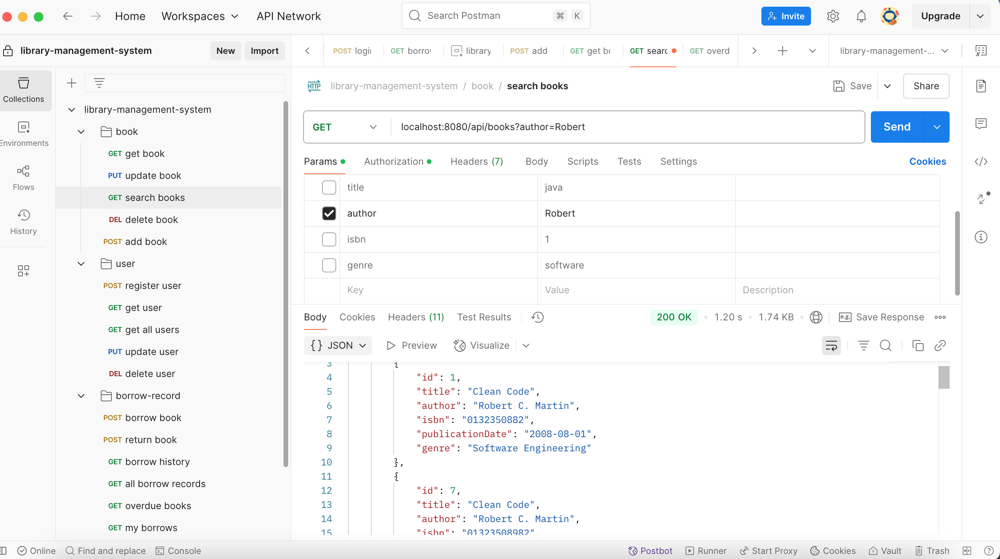

# Library Management System

A full-featured backend API for managing a library system — built with **Spring Boot**, **Java 21**, and **PostgreSQL**. It supports user roles (Admin, Librarian, Patron), book borrowing/return, JWT-based security, and Dockerized deployment.
    
---   
## Features

- User registration, login, and role-based authorization (JWT)
- Book management (CRUD + search by multiple fields)
- Borrow & return functionality with due/return dates
- Data initialization with default admin user
- Clean DTO structure for request/response abstraction
- Unit tests for core services
- Dockerized for easy deployment

---   
## Tech Stack

| Layer               | Technology                  |
|--------------------|-----------------------------|
| Backend             | Spring Boot (Java 21)       |
| Database            | PostgreSQL                  |
| Authentication      | Spring Security + JWT       |
| Build Tool          | Maven                       |
| Containerization    | Docker, Docker Compose      |
| Logging             | SLF4J (with Lombok)         |
| Validation          | Jakarta Bean Validation     |
| Object Mapping      | DTOs via custom mappers     |
---   

## 

## Notable Endpoints

| Endpoint                  | Method | Description                        |
|---------------------------|--------|------------------------------------|
| `/api/auth/register`     | POST   | Register a new user                |
| `/api/auth/login`        | POST   | Login and receive JWT              |
| `/api/books`             | GET    | List all books                     |
| `/api/books`             | POST   | Add a new book (LIBRARIAN only)   |
| `/api/books/search`      | GET    | Filter books by title, author...  |
| `/api/borrow`            | POST   | Borrow a book                      |
| `/api/return`            | POST   | Return a borrowed book             |


 *Full API reference available in Postman.*
## Postman Collection

You can test the API easily using the provided Postman collection:

[`docs/library-management-system.postman_collection.json`](docs/library-management-system.postman_collection.json)

---   

## 🧪 Testing

### Unit Tests

Covers core business logic:

- User registration and authentication
- Book creation, update, deletion
- Borrow and return flow

### Integration Tests (H2)

Includes API-level tests running against in-memory H2 database for:

- Auth endpoints
- Book endpoints
- Borrow/return endpoints

Run tests:

``` mvn test ```

## Screenshots

Below are sample screenshots of the working application:

1. **Postman - Successful login**  
   

2. **Postman - Search books**
   

3. **Docker logs - App started**  
   

4. **Test results - All tests passing**  
   
   


## ⚙️ Running the Application Locally

### Prerequisites

Before running the application locally, make sure you have the following installed:

- **Java 21** (or newer) — for building and running the Spring Boot application
- **Maven** — for building the project
- **PostgreSQL** — for the database
- **IDE** — IntelliJ IDEA, Eclipse, or any IDE with Java support

---  

### 1. Clone the Repository

First, clone the repository to your local machine:

```  
git clone https://github.com/ecenurzunbul/library-management-system.gitcd library-management-system
```  


### 2\. Configure Database Connection

Before running the application, make sure to set up your local PostgreSQL database:

**Database Name**: `librarydb`

**Username**: `libraryuser`

**Password**: `librarypass`


You can create this database using the PostgreSQL CLI or a tool like pgAdmin.

Alternatively, modify the `application.properties` or `application.yml` to match your local PostgreSQL configuration. You should find these configurations in the `src/main/resources` folder.

### Properties


`spring.datasource.url=jdbc:postgresql://localhost:5432/librarydb spring.datasource.username=libraryuser spring.datasource.password=librarypass spring.jpa.hibernate.ddl-auto=update`

* * *  

### 3\. Build the Project

If Maven is installed, you can build the project by running:
```  
mvn clean package  
```  

This will compile the project and create a JAR file in the `target/` folder.

* * *  

### 4\. Run the Application

Once the project is built, you can run the application with the following command:

`mvn spring-boot:run`

This will start the Spring Boot application on your local machine, and the server will be available at:

`http://localhost:8080`

* * *  

### 5\. Access the Application

* Open your browser and go to `http://localhost:8080`.

* Use Postman or cURL to interact with the API endpoints.


#### Example Request (Login as Admin):

`curl --location 'localhost:8080/api/auth/login' \ --header 'Content-Type: application/json' \ --data-raw '{ "email": "admin@library.com", "password": "test123" }'`

## ⚙️ Running the Application with Docker
### ✅ Prerequisites
- [Docker](https://www.docker.com/products/docker-desktop)
- Docker Compose macOS:  
  ``` brew install docker-compose ```

## Dockerization


### Prerequisites


- Docker installed :https://www.docker.com/products/docker-desktop/

- Docker Compose installed  
  -```  
brew install docker-compose```

### Running the Application with Docker


#### 1. Build the project JAR:


```  
mvn clean package  
```   

#### 2. Build and start containers:


```  
docker-compose up --build  
```   

#### 3. The backend server will be available at:


http://localhost:8080


Use Postman or curl to interact with the API endpoints.


To stop the containers:


```  
docker-compose down  
```   

## IMPORTANT
- "docker-compose up --build" will build the Docker image and start the containers
- It will create a new database if it does not exist
- It will INSERT THE FIRST ADMIN USER at the first run
- email: admin@library.com
- password: test123
- You can register new users and delete or update the admin user later
- If you want to start with a clean database, you can remove the existing database volume by running:


```  
docker-compose down -v  
```   

- You can start with login with the default admin user:


```  
curl --location 'localhost:8080/api/auth/login' \--header 'Content-Type: application/json' \ --data-raw '{ "email": "admin@library.com", "password": "test123" }' 
```   

### Notes

The `docker-compose.yml` starts two services:

1. **db**: PostgreSQL database configured with the following credentials:
    - **Username**: `libraryuser`
- **Password**: `librarypass`
- **Database**: `librarydb`

2. **app**: Spring Boot application container connected to the db service.

Database connection properties are set via environment variables injected into the app container:

#### Properties
spring.datasource.url=jdbc:postgresql://db:5432/librarydb    
spring.datasource.username=libraryuser    
spring.datasource.password=librarypass    
spring.jpa.hibernate.ddl-auto=update


Exposed ports:    
8080 for the Spring Boot app    
5432 for the database (optional, for local DB access)